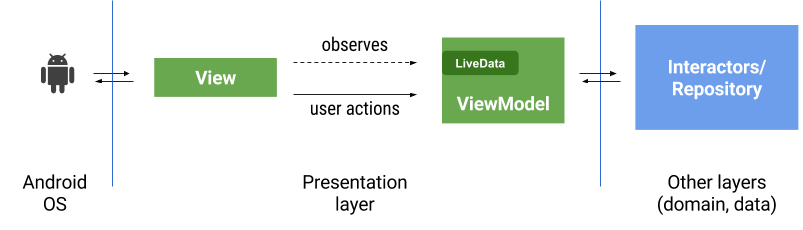

# ViewModel & Livedata
How to using ViewModel and LiveDate with simple Activity(retrofit)
<br>

[]()

# Preview :
* ViewModel and LiveDate :
<br>

[]()
[]()
[]()
[]()
[]()

<br>
&nbsp;
<br>

# SDK Required
+ Target sdk:<br>
[](https://android-arsenal.com/api?level=26)
+ Min sdk:<br>
[](https://android-arsenal.com/api?level=21)

# Social Media
<table style="border:0px;">
   <tr>
      <td>
<a href="https://www.linkedin.com/in/soussimohamed/">

</a>
      </td>
      <td>
         <a href="https://twitter.com/soussimohamed7/">

</a>
     </td>
  </tr> 
</table>  

# Licence

```
Copyright 2018 Soussidev, Inc.

Licensed under the Apache License, Version 2.0 (the "License");
you may not use this file except in compliance with the License.
You may obtain a copy of the License at

   http://www.apache.org/licenses/LICENSE-2.0

Unless required by applicable law or agreed to in writing, software
distributed under the License is distributed on an "AS IS" BASIS,
WITHOUT WARRANTIES OR CONDITIONS OF ANY KIND, either express or implied.
See the License for the specific language governing permissions and
limitations under the License.
```
